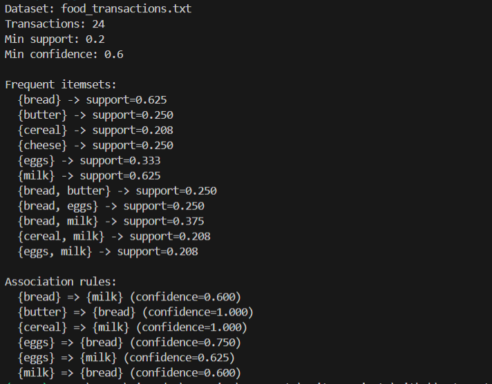
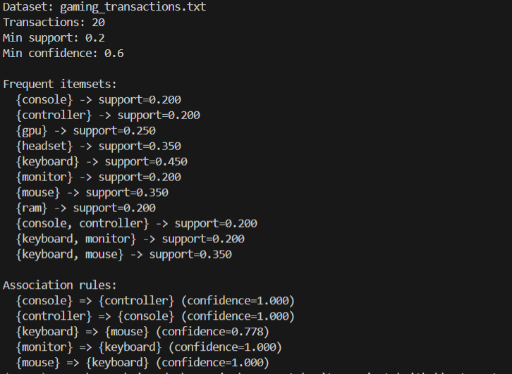

# A-Apriori

Apriori implementation for mining frequent itemsets and association rules from transaction data.

## Files

- `Aprio.py`: Apriori + rule generation script with CLI arguments.
- `food_transactions.txt`: Food-related transactions dataset.
- `gaming_transactions.txt`: Gaming hardware/peripheral transactions dataset.

## References

Example output image 1:



Example output image 2:



## Run

```powershell
cd A-Apriori
python Aprio.py
```

## CLI Options

- `dataset` (optional): dataset file path.
- `--min-support`: support threshold in `[0, 1]`.
- `--min-confidence`: confidence threshold in `[0, 1]`.

## Example 1: Default dataset (gaming)

```powershell
python Aprio.py
```

What it does:

- Loads `gaming_transactions.txt`.
- Prints frequent itemsets.
- Prints association rules that pass confidence threshold.

## Example 2: Food dataset with stricter thresholds

```powershell
python Aprio.py food_transactions.txt --min-support 0.25 --min-confidence 0.7
```

What it does:

- Mines from `food_transactions.txt`.
- Keeps only higher-support itemsets and higher-confidence rules.

## Notes

- If no rules meet confidence threshold, the script prints: `(none above confidence threshold)`.
- Use lower support/confidence if results are too sparse.
