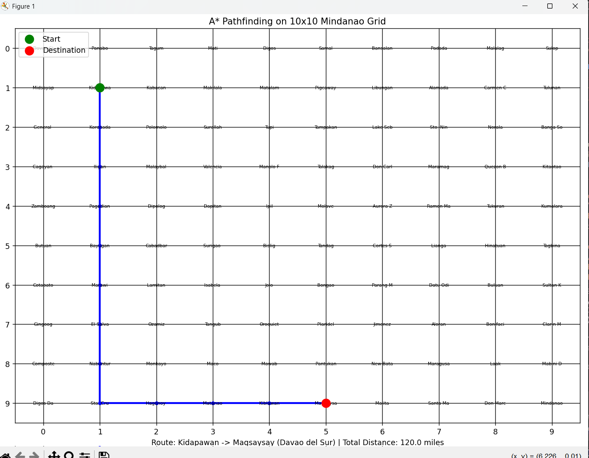
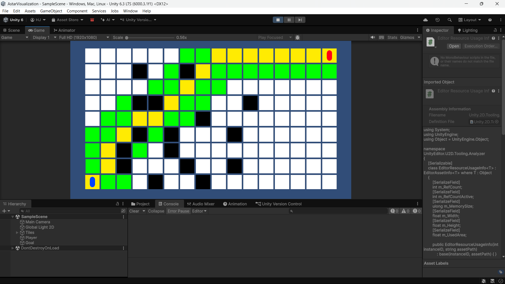

# AStar

A* pathfinding implementation on a 10x10 grid of Mindanao cities/municipalities.

## Files

- `Number2.py`: Console + matplotlib visualization for A* route search.
- `test1.png`, `test2.png`, `test12nd.png`: Captured pathfinding outputs.

## References

Reference screenshot 1:


Reference screenshot 2:



Reference screenshot 3:



## Run

```powershell
cd AStar
python Number2.py
```

The script will ask for:

- Start: index (`0-99`) or exact place name.
- Destination: index (`0-99`) or exact place name.

## Example 1: Index-based route

Input:

- Start: `0`
- Destination: `99`

Expected behavior:

- Finds a route from top-left to bottom-right of the grid.
- Distance is based on adjacent moves (`10 miles` per move).

## Example 2: Name-based route

Input:

- Start: `Davao City`
- Destination: `Koronadal`

Expected behavior:

- Resolves names to their grid positions.
- Computes and visualizes the route and total distance.

## Notes

- Input names must match the place names exactly.
- Visualization opens in a matplotlib window with route, start, and destination markers.
