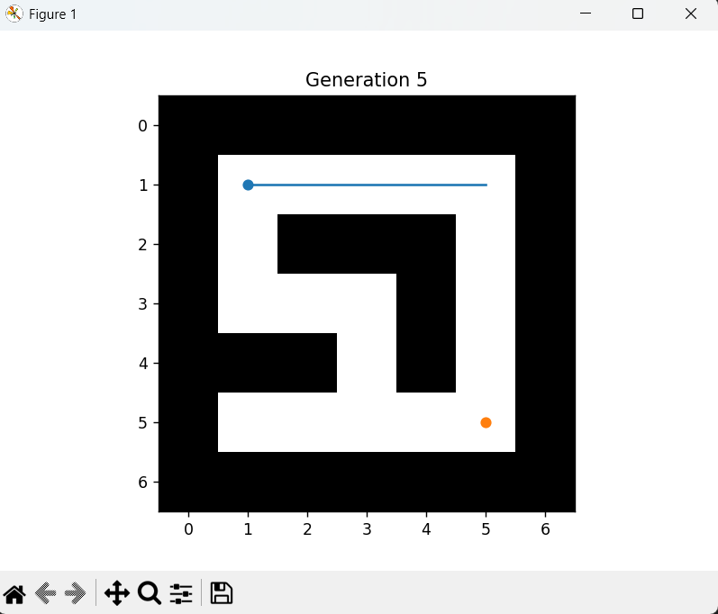
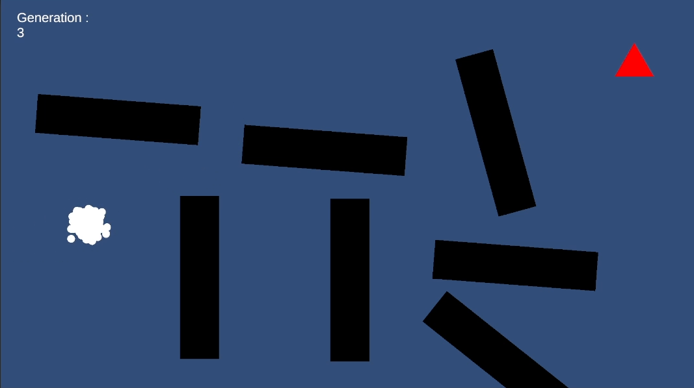

# EvolutionAlgo

Evolutionary algorithm experiments:

- Python genetic algorithm for maze navigation.
- Unity project (`GeneticAlgo`) for genetic algorithm visualization.

## Files

- `maze.py`: Python genetic algorithm simulation on a fixed maze.
- `Maze.png`: Maze-related reference image.
- `Genetic.png`: Genetic algorithm reference image.
- `Genetic.mp4`: Genetic algorithm reference video.
- `GeneticAlgo/`: Unity project folder.

## References

Maze reference image:



Genetic algorithm reference image:



Reference video:

[Open `Genetic.mp4`](Genetic.mp4)

## Python Run

```powershell
cd EvolutionAlgo
python maze.py
```

## Example 1: Default genetic run

```powershell
python maze.py
```

What to observe:

- Best agent path updates by generation.
- Population evolves toward reaching the goal.
- Fitness improves over time.

## Example 2: Mutation tuning experiment

Edit constants in `maze.py`, then rerun:

- Set `MUTATION_RATE = 0.10` and run once.
- Set `MUTATION_RATE = 0.02` and run once.

Compare:

- Convergence speed.
- Path stability and consistency near later generations.

## Unity Project

Open `GeneticAlgo` in Unity Hub to view or extend the Unity-based visualization.
